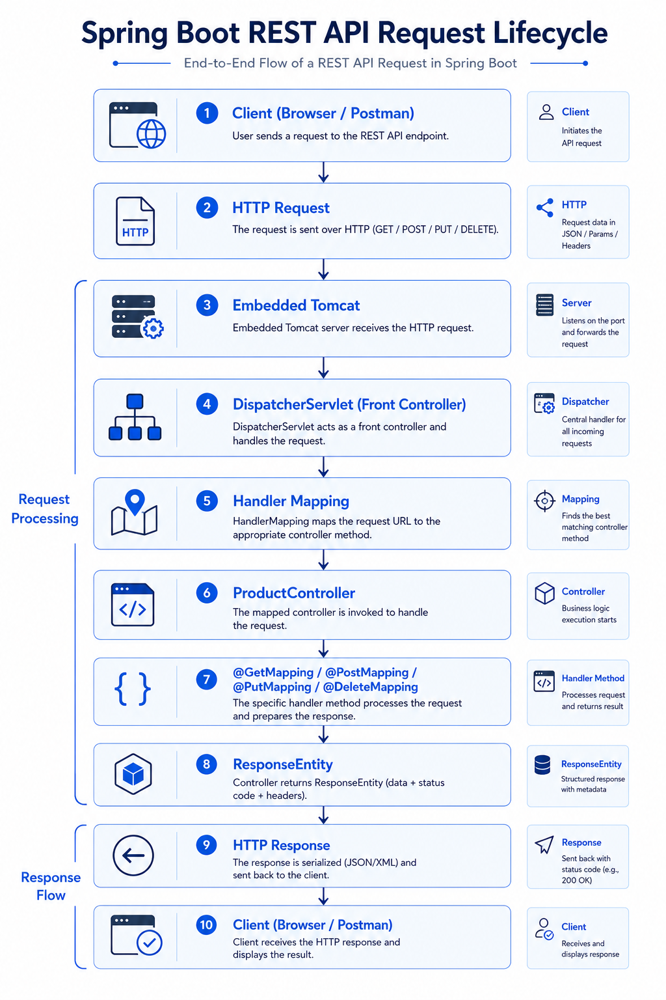

# 🌐 Day 08 - Building REST APIs with Spring Boot

> Learning how Spring Boot exposes resources over HTTP using REST architecture and controller annotations.

---

## 🎯 Objective

Understand how REST APIs work, how Spring Boot maps HTTP requests to controller methods, and how clients communicate with the application using standard HTTP methods.

---

## 📚 Topics Covered

- REST Architecture
- REST Resources
- HTTP Methods
- `@RestController`
- `@RequestMapping`
- `@GetMapping`
- `@PostMapping`
- `@PutMapping`
- `@DeleteMapping`
- `@PathVariable`
- `ResponseEntity`
- HTTP Status Codes
- API Endpoint Design

---

## 🌍 What is REST?

REST (Representational State Transfer) is an architectural style used to build web services where clients communicate with servers using HTTP requests.

Every resource (Product, User, Order, Category) is identified using a unique URL.

Example:

```http
GET /api/products
GET /api/products/1
POST /api/products
PUT /api/products/1
DELETE /api/products/1
```

---

## 🏗️ REST API Request Flow

```text
Client (Browser/Postman)
          │
          ▼
HTTP Request
          │
          ▼
Embedded Tomcat
          │
          ▼
DispatcherServlet
          │
          ▼
Handler Mapping
          │
          ▼
ProductController
          │
          ▼
Controller Method
          │
          ▼
ResponseEntity
          │
          ▼
HTTP Response
          │
          ▼
Client
```

---

## 🔍 Understanding Controller Annotations

### `@RestController`

Marks a class as a REST Controller.

- Receives HTTP requests
- Executes controller methods
- Returns data directly as the HTTP response

```java
@RestController
public class ProductController {

}
```

---

### `@RequestMapping`

Defines the common base URL for all APIs inside the controller.

```java
@RequestMapping("/api/products")
```

Instead of repeating:

```
/api/products
```

for every endpoint, we define it once.

---

### `@GetMapping`

Handles HTTP GET requests.

Used to retrieve data.

Example:

```http
GET /api/products
```

or

```http
GET /api/products/10
```

---

### `@PostMapping`

Handles HTTP POST requests.

Used to create new resources.

Example:

```http
POST /api/products
```

---

### `@PutMapping`

Handles HTTP PUT requests.

Used to update existing resources.

Example:

```http
PUT /api/products/5
```

---

### `@DeleteMapping`

Handles HTTP DELETE requests.

Used to remove resources.

Example:

```http
DELETE /api/products/5
```

---

### `@PathVariable`

Extracts values directly from the URL.

Example:

```http
GET /api/products/5
```

```java
@GetMapping("/{id}")
public ResponseEntity<String> getProduct(@PathVariable Long id) {

    return ResponseEntity.ok("Product Id : " + id);

}
```

---

## 💻 Practical Implementation

Implemented ProductController with:

- Get All Products
- Get Product By ID
- Create Product
- Update Product
- Delete Product

Tested all endpoints using **Postman**.

---

## 📂 API Endpoints

| Method | Endpoint | Description |
|---------|----------|-------------|
| GET | `/api/products` | Get all products |
| GET | `/api/products/{id}` | Get product by ID |
| POST | `/api/products` | Create product |
| PUT | `/api/products/{id}` | Update product |
| DELETE | `/api/products/{id}` | Delete product |

---

## 📦 Why ResponseEntity?

`ResponseEntity` gives complete control over the HTTP response.

It allows us to return:

- Response Body
- HTTP Status Code
- HTTP Headers

Example:

```java
return ResponseEntity.ok("Product Created");
```

Instead of simply returning a String.

---

## ⭐ Best Practices

- Use nouns in API URLs (`/products`, `/users`, `/orders`)
- Follow REST conventions
- Return proper HTTP status codes
- Keep controllers lightweight
- Move business logic to the Service layer
- Return `ResponseEntity` for better response control

---

## 🧠 Key Learnings

- Spring maps URLs to controller methods using annotations.
- Every API endpoint represents an operation on a resource.
- `DispatcherServlet` acts as the front controller.
- `ResponseEntity` provides complete control over HTTP responses.
- `@PathVariable` extracts dynamic values from the request URL.

---

## 💡 Interview Questions

### What is REST?

REST is an architectural style for designing web services using HTTP protocols and resource-based URLs.

---

### Difference between `@Controller` and `@RestController`?

`@Controller`
- Returns Views (HTML/JSP)

`@RestController`
- Returns data directly (JSON/String/XML)

---

### Why do we use `ResponseEntity`?

To control:

- HTTP Status Code
- Response Body
- Response Headers

---

### What is `@PathVariable`?

It extracts dynamic values from the request URL and passes them to controller methods.

---

### What is DispatcherServlet?

DispatcherServlet is the Front Controller of Spring MVC. It receives every incoming HTTP request and forwards it to the appropriate controller.

---

## 🎯 Learning Outcome

By the end of Day 08, I understood how REST APIs are designed, how Spring Boot maps HTTP requests to controller methods, how REST endpoints communicate with clients, and how HTTP responses are generated using `ResponseEntity`.

---


## 🖼️ Visual Overview

