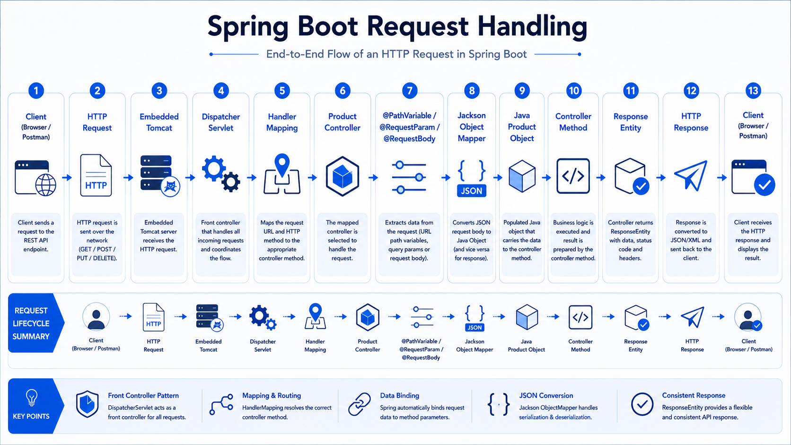

# 📨 Day 09 - Request Handling in Spring Boot

> Understanding how Spring Boot receives HTTP requests, extracts data from different sources, converts JSON into Java objects, and passes it to controller methods.

---

## 🎯 Objective

Learn how Spring Boot handles incoming HTTP requests, maps request data to Java objects, and provides different ways to receive client input.

---

## 📚 Topics Covered

- HTTP Request Lifecycle
- Request Mapping
- `@PathVariable`
- `@RequestParam`
- `@RequestBody`
- JSON Request & Response
- Jackson Object Mapper
- Request Headers (Introduction)
- URL Parameters
- Query Parameters
- Request Body
- ResponseEntity

---

## 🌍 Understanding Request Handling

Whenever a client sends an HTTP request, Spring Boot receives it through the embedded server and maps it to the appropriate controller method.

The request data can come from:

- URL Path
- Query Parameters
- Request Body
- Request Headers

Spring automatically extracts this data using annotations.

---

## 🏗️ Spring Request Handling Flow

```text
Client (Browser/Postman)
          │
          ▼
HTTP Request
          │
          ▼
Embedded Tomcat
          │
          ▼
DispatcherServlet
          │
          ▼
Handler Mapping
          │
          ▼
ProductController
          │
          ▼
Request Mapping
(@PathVariable / @RequestParam / @RequestBody)
          │
          ▼
Jackson Converts JSON
          │
          ▼
Java Object Created
          │
          ▼
Controller Method Executes
          │
          ▼
ResponseEntity
          │
          ▼
HTTP Response
```

---

# 📍 @PathVariable

Used to extract dynamic values from the URL.

### Example URL

```http
GET /api/products/5
```

### Controller

```java
@GetMapping("/{id}")
public ResponseEntity<String> getProduct(@PathVariable Long id){

    return ResponseEntity.ok("Product Id : " + id);

}
```

Spring extracts:

```
5
```

and stores it inside

```java
Long id
```

---

# 🔎 @RequestParam

Used to receive query parameters.

### Example

```http
GET /api/products/search?keyword=laptop
```

Controller

```java
@GetMapping("/search")
public String searchProduct(
        @RequestParam String keyword){

    return keyword;

}
```

Spring extracts

```
laptop
```

from the URL.

---

# 📦 @RequestBody

Used to receive JSON data from the client.

Example Request

```json
{
  "name":"Laptop",
  "price":55000
}
```

Controller

```java
@PostMapping
public ResponseEntity<String> createProduct(
        @RequestBody Product product){

    return ResponseEntity.ok("Product Created");

}
```

Spring converts JSON into a Java object automatically.

---

# ⚙️ Jackson

Jackson is the library responsible for converting

```text
JSON
        ⇄
Java Object
```

Spring Boot automatically uses Jackson behind the scenes.

---

## 💻 Practical Implementation

Created Product APIs using:

- GET All Products
- GET Product by ID
- POST Product
- PUT Product
- DELETE Product

Tested every endpoint using **Postman**.

Observed how Spring automatically maps request data into Java method parameters.

---

## 📂 API Endpoints

| Method | Endpoint | Description |
|---------|----------|-------------|
| GET | `/api/products` | Get all products |
| GET | `/api/products/{id}` | Get product by ID |
| POST | `/api/products` | Create product |
| PUT | `/api/products/{id}` | Update product |
| DELETE | `/api/products/{id}` | Delete product |

---

## ⭐ Best Practices

- Use `@PathVariable` for resource identifiers.
- Use `@RequestParam` for filtering and searching.
- Use `@RequestBody` for creating or updating resources.
- Keep controllers lightweight.
- Let Spring perform JSON mapping automatically.

---

## ⚠️ Common Mistakes

### ❌ Forgetting `@PathVariable`

```java
@GetMapping("/{id}")
public String getProduct(Long id)
```

Spring cannot bind the URL value.

Correct

```java
@GetMapping("/{id}")
public String getProduct(@PathVariable Long id)
```

---

### ❌ Wrong Mapping

Using

```java
@PutMapping
```

for delete operations.

Correct

```java
@DeleteMapping
```

---

### ❌ Invalid JSON

Sending malformed JSON results in

```
400 Bad Request
```

---

## 🧠 Key Learnings

- Spring automatically maps HTTP requests to controller methods.
- `@PathVariable` extracts values from the URL.
- `@RequestParam` extracts query parameters.
- `@RequestBody` converts JSON into Java objects.
- Jackson performs JSON ↔ Java conversion automatically.
- Controllers receive ready-to-use Java objects.

---

## 💡 Interview Questions

### What is `@RequestBody`?

It tells Spring to convert the HTTP request body (usually JSON) into a Java object.

---

### What is the difference between `@PathVariable` and `@RequestParam`?

`@PathVariable`

- Reads values from the URL path.

Example

```
/products/10
```

`@RequestParam`

- Reads query parameters.

Example

```
/products?category=mobile
```

---

### What is Jackson?

Jackson is a Java library used by Spring Boot to convert JSON into Java objects and Java objects into JSON.

---

### How does Spring know which JSON field belongs to which Java field?

Jackson matches JSON keys with JavaBean property names using getter and setter methods.

---

## 🎯 Learning Outcome

By the end of Day 09, I understood how Spring Boot receives HTTP requests, extracts request data using annotations, converts JSON into Java objects with Jackson, and passes fully populated objects to controller methods.

---


## 🖼️ Visual Overview



