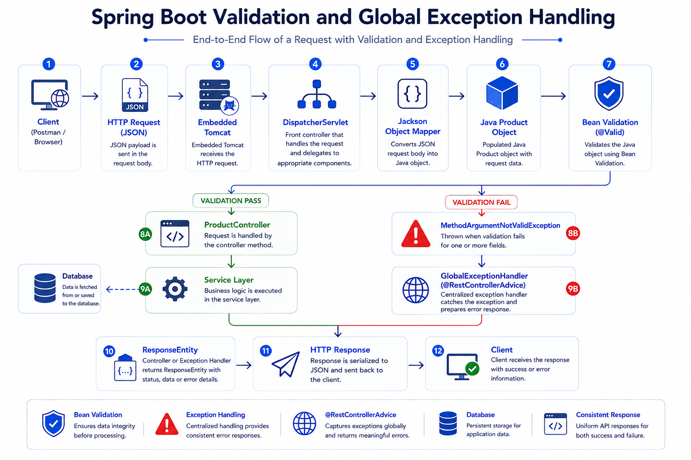

# Day 10 - Bean Validation & Global Exception Handling

> Learning how Spring Boot validates incoming requests, prevents invalid data from entering the application, and handles exceptions using a centralized error handling mechanism.

---

## 🎯 Objective

Understand how Spring Boot validates request data, automatically throws validation exceptions, propagates exceptions through the application, and generates professional API responses using Global Exception Handling.

---

## 📚 Topics Covered

### Bean Validation

- Bean Validation
- `@Valid`
- `@NotNull`
- `@NotBlank`
- `@NotEmpty`
- `@Positive`
- `@Min`
- `@Max`
- `@Email`
- `@Size`
- `@Pattern`

### Exception Handling

- Exception
- Exception Propagation
- `@RestControllerAdvice`
- `@ExceptionHandler`
- `MethodArgumentNotValidException`
- Custom Exceptions
- ResponseEntity for Error Responses

### Core Java Concepts

- Primitive vs Wrapper Classes
- `double` vs `Double`
- JavaBeans Convention
- Getters & Setters
- Jackson Property Mapping

---

# 🌍 Why Validation?

Never trust client input.

A user can send requests from:

- Web Application
- Mobile Application
- Postman
- cURL
- Any HTTP Client

Frontend validation can always be bypassed.

Therefore, validation must also be performed on the backend.

---

# 🏗️ Validation Request Flow

```text
Client
        │
        ▼
HTTP Request (JSON)
        │
        ▼
DispatcherServlet
        │
        ▼
Jackson
(JSON → Java Object)
        │
        ▼
Bean Validation (@Valid)
        │
        ├───────────────┐
        │               │
        ▼               ▼
Validation Pass     Validation Fail
        │               │
        ▼               ▼
Controller      MethodArgumentNotValidException
        │               │
        ▼               ▼
Business Logic   Global Exception Handler
        │               │
        └───────┬───────┘
                ▼
         HTTP Response
```

---

# 📌 @Valid

`@Valid` tells Spring to validate an object before executing the controller method.

Example

```java
@PostMapping
public ResponseEntity<String> createProduct(
        @Valid @RequestBody Product product){

    return ResponseEntity.ok("Product Created");

}
```

If any validation rule fails, Spring immediately throws an exception.

The controller method is **not executed**.

---

# 📌 Bean Validation Annotations

### @NotNull

Field must not be `null`.

---

### @NotBlank

Used for Strings.

Rejects:

- null
- ""
- "    "

---

### @NotEmpty

Rejects:

- null
- Empty Collections
- Empty Arrays
- Empty Strings

---

### @Positive

Value must be greater than zero.

---

### @Min

Minimum allowed value.

```java
@Min(1)
```

---

### @Max

Maximum allowed value.

```java
@Max(100)
```

---

### @Email

Valid email format.

---

### @Size

Validates String, Collection or Array size.

Example

```java
@Size(min = 3, max = 50)
```

---

### @Pattern

Validates text using Regular Expressions.

---

# ⚙️ Why Wrapper Classes?

Instead of

```java
double price;
```

Use

```java
Double price;
```

Reason:

Primitive

```
double
```

automatically becomes

```
0.0
```

Wrapper

```
Double
```

can remain

```
null
```

which allows validation to detect missing values.

---

# ⚙️ Jackson & JavaBeans

Incoming JSON

```json
{
    "name":"Laptop",
    "price":55000
}
```

Jackson creates

```java
Product product = new Product();
```

Then calls

```java
product.setName("Laptop");
product.setPrice(55000);
```

Therefore JavaBean getter/setter naming conventions are important.

---

# 🌍 Exception Propagation

Suppose

```
Controller
        │
        ▼
Service
        │
        ▼
Repository
```

Repository cannot find a product.

Service throws

```java
throw new ProductNotFoundException("Product not found");
```

The exception travels back through

```
Repository
        ▲
Service
        ▲
Controller
        ▲
DispatcherServlet
        ▼
Global Exception Handler
```

until Spring finds a matching exception handler.

---

# 🌍 Global Exception Handling

Instead of writing

```java
try{
}
catch(...){
}
```

inside every controller,

Spring provides

```java
@RestControllerAdvice
```

to handle exceptions for the entire application.

Example

```java
@RestControllerAdvice
public class GlobalExceptionHandler {

    @ExceptionHandler(ProductNotFoundException.class)
    public ResponseEntity<String> handle(ProductNotFoundException ex){

        return ResponseEntity
                .status(HttpStatus.NOT_FOUND)
                .body(ex.getMessage());

    }

}
```

---

# 💻 Practical Implementation

Implemented

- Bean Validation
- Product Validation
- GlobalExceptionHandler
- Validation Testing
- Exception Propagation
- Postman Validation Testing

---

# ⭐ Best Practices

- Always validate request objects.
- Prefer Wrapper Classes over primitives.
- Keep validation in DTOs/Request Objects.
- Use Global Exception Handling.
- Return meaningful error messages.
- Avoid duplicate try-catch blocks.

---

# ⚠️ Common Mistakes

### ❌ Forgetting @Valid

Validation annotations will never execute.

---

### ❌ Using Primitive Types

```java
double price;
```

Cannot detect missing values.

Use

```java
Double price;
```

instead.

---

### ❌ Returning Generic Errors

Avoid

```
400 Bad Request
```

without any explanation.

Return meaningful API responses.

---

### ❌ Handling Every Exception Inside Controllers

Creates repetitive code.

Prefer centralized exception handling.

---

# 🧠 Key Learnings

- Spring validates objects before controller execution.
- Jackson converts JSON into Java objects.
- Validation failures automatically throw exceptions.
- Exceptions propagate through the application.
- `@RestControllerAdvice` centralizes error handling.
- Wrapper classes improve validation.
- JavaBean conventions are essential for Jackson.

---

# 🛒 Real Nexora Usage

Example

```
POST /api/products
```

Request

```json
{
    "name":"",
    "price":-500
}
```

Validation fails.

Spring throws

```
MethodArgumentNotValidException
```

Global Exception Handler catches the exception.

Client receives

```json
{
    "status":400,
    "message":"Validation Failed"
}
```

Instead of an unstructured error.

---

# 💡 Interview Questions

### What is Bean Validation?

A standard mechanism for validating Java objects using annotations before processing business logic.

---

### Why do we use `@Valid`?

To trigger validation on request objects before the controller method executes.

---

### What is `MethodArgumentNotValidException`?

An exception automatically thrown by Spring when Bean Validation fails.

---

### Why use Wrapper Classes instead of primitives?

Wrapper classes can store `null`, allowing validation to detect missing values.

---

### What is `@RestControllerAdvice`?

A global exception handler that handles exceptions thrown during request processing across all controllers.

---

### How does exception propagation work?

Exceptions travel back through the method call stack until they are caught. If no controller catches them, Spring invokes the matching `@ExceptionHandler` in the Global Exception Handler.

---

## 🎯 Learning Outcome

By the end of Day 10, I understood how Spring Boot validates incoming requests, how Jackson creates Java objects from JSON, why wrapper classes are important, how exceptions propagate through the application, and how Global Exception Handling produces clean, consistent API responses.

---

## 🖼️ Visual Overview

