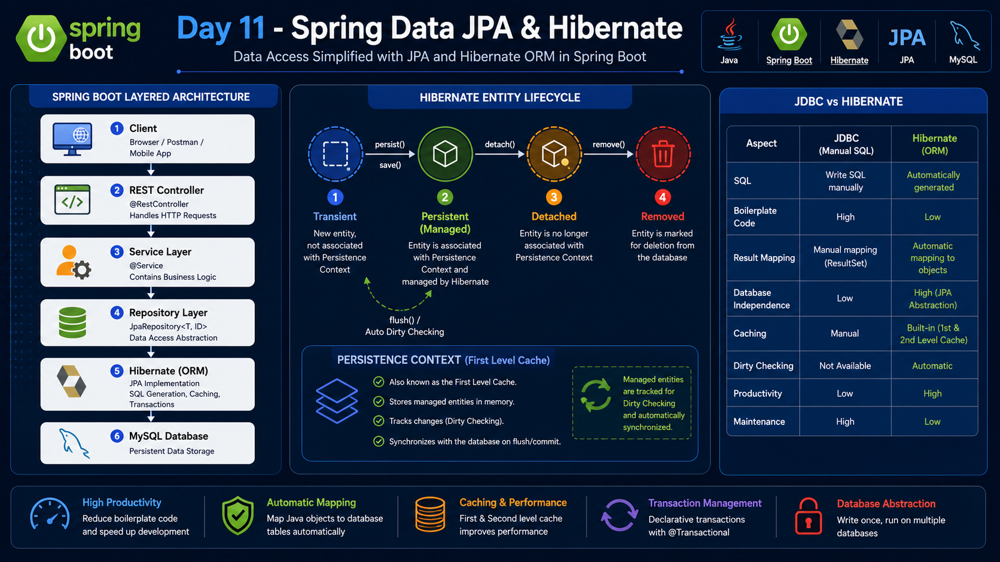

# Day 11 - Spring Data JPA & Hibernate Fundamentals

## 📌 Overview

Day 11 focused on integrating Spring Boot with MySQL using Spring Data JPA and Hibernate. We explored how ORM works internally, how entities are managed, and how Spring Data JPA simplifies database operations.

---

## 📚 Topics Covered

### ORM (Object Relational Mapping)
- What is ORM?
- Benefits of ORM
- JDBC vs ORM

### Hibernate
- Hibernate Architecture
- Hibernate Workflow
- Dirty Checking
- Persistence Context
- Entity Lifecycle

### JPA
- What is JPA?
- Why Hibernate implements JPA
- Spring Data JPA

### Entity Mapping
- `@Entity`
- `@Table`
- `@Id`
- `@GeneratedValue`
- `@Column`

### Repository
- JpaRepository
- CRUD Operations
- Automatic Repository Implementation

### Service Layer
- Business Logic
- Service Interface
- Service Implementation
- Constructor Injection

### Dependency Injection
- Bean Creation
- Bean Injection
- Constructor Injection
- Field Injection
- `@Autowired`
- `final` keyword

### MySQL Integration
- Spring Data JPA Dependency
- MySQL Driver
- application.properties Configuration
- Hibernate DDL Auto

### Practical
- Created Product Entity
- Created Product Repository
- Created Product Service
- Created Product Controller
- Saved First Product
- Verified Data in MySQL

---

## 🛠 Technologies

- Java
- Spring Boot
- Spring Data JPA
- Hibernate
- MySQL

---

## 📂 Project Flow

```
Client
    │
    ▼
Controller
    │
    ▼
Service
    │
    ▼
Repository
    │
    ▼
Hibernate
    │
    ▼
MySQL
```

---

## 🎯 Key Learnings

- Understanding ORM architecture
- Difference between JPA and Hibernate
- Entity lifecycle
- Persistence Context
- Dirty Checking
- Repository Pattern
- Constructor-based Dependency Injection
- Spring Bean Management
- Building a layered Spring Boot application

---

## 🖼️ Visual Overview

