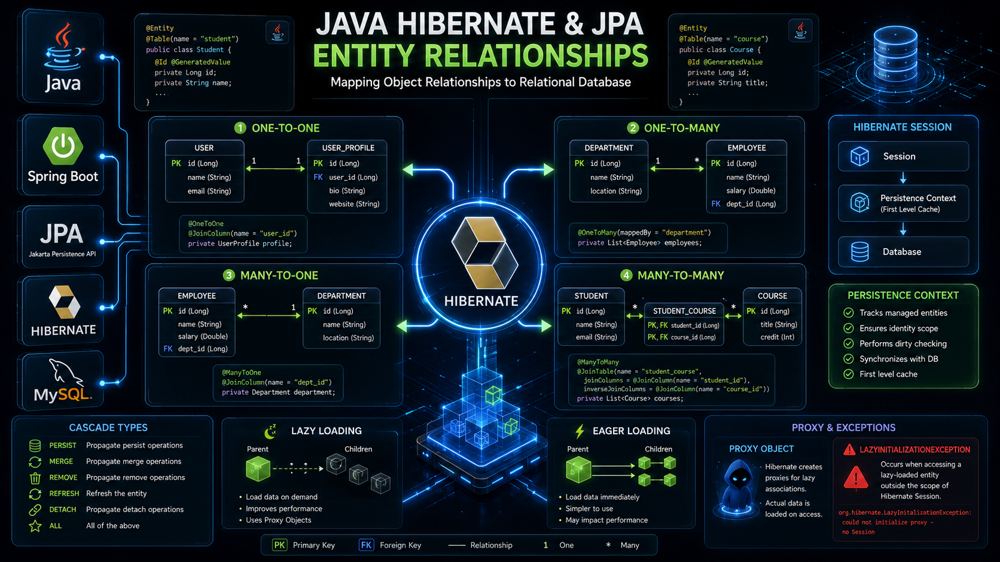

# Day 12 - JPA Entity Relationships

## Topics Covered

### Database Concepts
- Primary Key
- Foreign Key
- Database Normalization

### JPA Relationships
- One-to-One (@OneToOne)
- Many-to-One (@ManyToOne)
- One-to-Many (@OneToMany)
- Many-to-Many (@ManyToMany)

### Relationship Mapping
- @JoinColumn
- @JoinTable
- mappedBy
- Owning Side vs Inverse Side

### Hibernate Internals
- How Hibernate stores object relationships
- How foreign keys are generated
- Join Table working
- Bidirectional Relationships

### Cascade Types
- PERSIST
- MERGE
- REMOVE
- ALL
- When to use Cascade
- When NOT to use Cascade

### Fetch Types
- FetchType.LAZY
- FetchType.EAGER
- Proxy Objects
- LazyInitializationException

### Best Practices
- Prefer LAZY loading
- Avoid unnecessary bidirectional relationships
- Avoid CascadeType.ALL everywhere
- Return DTOs instead of Entities
- Prevent circular references

---

## Practical Understanding

✔ How Hibernate converts Java Objects into Database Rows

✔ Why we use Objects instead of Foreign Key fields

✔ Difference between Java References and Database Foreign Keys

✔ Internal working of mappedBy

✔ Internal working of Join Table

✔ How Cascade automatically saves child entities

✔ Difference between LAZY and EAGER loading

✔ Common mistakes in production projects

---

## 🖼️ Visual Overview

