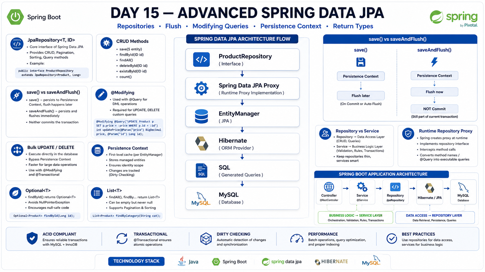

# Day 15 — Advanced Spring Data JPA

## 📚 Overview

Day 15 focused on Advanced Spring Data JPA and understanding how Spring Data JPA simplifies repository development while working with Hibernate, the Persistence Context, and MySQL.

The main goal was to understand the `JpaRepository` hierarchy, built-in repository operations, flushing, modifying queries, bulk operations, repository return types, and the separation between repository and service responsibilities.

---

## 🎯 Learning Objectives

- Understand the Spring Data JPA repository hierarchy
- Understand `JpaRepository<Entity, ID>`
- Understand built-in CRUD operations
- Understand `save()` vs `saveAndFlush()`
- Understand `@Modifying` queries
- Understand bulk UPDATE and DELETE operations
- Understand Persistence Context synchronization issues
- Understand repository return types
- Understand `Optional<T>`
- Understand repository and service responsibilities
- Understand how Spring Data JPA creates repository implementations/proxies

---

## 1. Spring Data JPA Repository Hierarchy

Spring Data JPA provides repository interfaces that reduce boilerplate data-access code.

```text
Repository
    ↓
CrudRepository
    ↓
JpaRepository
````

Example:

```java
public interface ProductRepository
        extends JpaRepository<Product, Long> {
}
```

The generic types are:

```text
Product → Entity type
Long    → Primary key type
```

---

## 2. Built-in CRUD Methods

`JpaRepository` provides many methods automatically.

Common methods include:

```java
save()
findById()
findAll()
existsById()
count()
deleteById()
```

No implementation class needs to be written manually.

---

## 3. `save()`

Example:

```java
productRepository.save(product);
```

For a new entity, Hibernate can eventually generate an `INSERT`.

For an existing entity, the operation can result in an `UPDATE` depending on the entity state and Spring Data JPA's handling.

Important:

```text
save()
   ↓
Persistence Context
   ↓
Flush
   ↓
SQL
   ↓
Commit
```

`save()` does not mean that the transaction is immediately committed.

---

## 4. `saveAndFlush()`

```java
productRepository.saveAndFlush(product);
```

`saveAndFlush()` causes the Persistence Context to be flushed immediately.

```text
save()
   ↓
Flush later

saveAndFlush()
   ↓
Flush now
```

However:

> **Flush is not the same as Commit.**

Even after `saveAndFlush()`, the transaction can still roll back.

```text
saveAndFlush()
      ↓
SQL executed
      ↓
Transaction still active
      ↓
Exception
      ↓
Rollback
```

---

## 5. `@Modifying` Queries

`@Modifying` is used when an `@Query` performs a data modification such as `UPDATE` or `DELETE`.

Example:

```java
@Modifying
@Query("""
    UPDATE Product p
    SET p.active = false
    WHERE p.shopkeeper.id = :shopkeeperId
""")
int deactivateProducts(Long shopkeeperId);
```

The method can return the number of affected rows.

---

## 6. Bulk UPDATE and DELETE

For a large number of records, loading every entity and changing them individually may be inefficient.

A bulk query can modify many rows directly.

Example:

```java
@Modifying
@Query("""
    UPDATE Product p
    SET p.active = false
    WHERE p.shopkeeper.id = :shopkeeperId
""")
int deactivateProducts(Long shopkeeperId);
```

Bulk operations bypass normal per-entity dirty checking for those rows.

---

## 7. Persistence Context Synchronization

Bulk `UPDATE` or `DELETE` operations can cause the Persistence Context to contain stale entity data.

Example:

```text
Persistence Context
Product.active = true

        ↓
    Bulk UPDATE
        ↓
Database
Product.active = false
```

The Persistence Context may still contain:

```text
Product.active = true
```

This can make:

```text
Persistence Context ≠ Database
```

Spring Data JPA provides:

```java
@Modifying(clearAutomatically = true)
```

to clear the Persistence Context after the modifying query.

`flushAutomatically = true` can also be used when pending changes need to be flushed before executing the modifying query.

---

## 8. Repository Return Types

Different query requirements can use different return types.

### One possible entity

```java
Optional<Product>
```

Example:

```java
Optional<Product> findBySku(String sku);
```

### Multiple entities

```java
List<Product>
```

Example:

```java
List<Product> findByNameContainingIgnoreCase(String keyword);
```

### Paginated results

```java
Page<Product>
```

Pagination will be studied in detail on **Day 16**.

---

## 9. `Optional<T>`

`Optional<T>` is useful when an entity may or may not exist.

Example:

```java
Optional<Product> product =
        productRepository.findById(id);
```

Instead of blindly calling:

```java
.get()
```

we can use:

```java
Product product = productRepository
        .findById(id)
        .orElseThrow();
```

This makes the possibility of a missing entity explicit.

---

## 10. Repository vs Service

The Repository layer focuses on:

```text
Data Access
```

The Service layer focuses on:

```text
Business Logic
```

Typical application flow:

```text
Controller
    ↓
Service
    ↓
Repository
    ↓
Hibernate / JPA
    ↓
MySQL
```

Business rules such as:

> A shopkeeper can update only their own product.

belong primarily in the **Service layer**.

---

## 11. Spring Data JPA Repository Proxy

When we write:

```java
public interface ProductRepository
        extends JpaRepository<Product, Long> {
}
```

we don't manually create:

```java
ProductRepositoryImpl
```

Spring Data JPA creates a runtime implementation/proxy.

Conceptually:

```text
ProductRepository
        ↓
Spring Data JPA Proxy
        ↓
EntityManager
        ↓
Hibernate
        ↓
SQL
        ↓
MySQL
```

This is another example of Spring's extensive use of proxies.

---

## 🔗 Connection with Day 14

Day 14:

```text
@Transactional
    ↓
Spring Proxy
    ↓
Service Method
```

Day 15:

```text
JpaRepository
    ↓
Spring Data JPA Proxy
    ↓
Repository Operations
```

Both demonstrate how Spring can provide behavior around our code through proxies.

---

# 🛒 Nexora Connection

Nexora currently has the basic package structure:

```text
com.nexora
├── controller
├── entity
├── exception
├── repository
├── service
└── service.impl
```

Day 15 established the repository concepts that will later be used when the Nexora domain model is progressively implemented.

We are intentionally not rushing into building the complete Nexora entity/domain model yet.

---

# 🧠 Key Takeaways

```text
JpaRepository
    ↓
Built-in CRUD operations

save()
    ↓
Persistence Context

saveAndFlush()
    ↓
Immediate Flush
    ≠
Commit

@Modifying
    ↓
UPDATE / DELETE queries

Bulk operations
    ↓
Efficient for mass changes
    ↓
Can cause stale Persistence Context

Optional<T>
    ↓
Zero or one result

List<T>
    ↓
Multiple results

Service
    ↓
Business Logic

Repository
    ↓
Data Access

Spring Data JPA
    ↓
Runtime Repository Proxy
```

---

## 🖼️ Visual Overview

