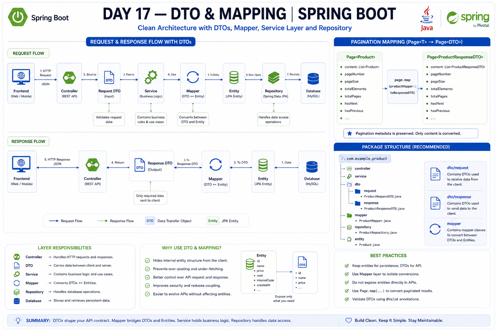

# Day 17 --- DTO & Mapping

## 📚 Overview

Day 17 focused on Data Transfer Objects (DTOs) and Entity-DTO mapping in
Spring Boot.

DTOs help control the data transferred through APIs and prevent the API
layer from being tightly coupled to the JPA entity model.

## 🎯 Learning Objectives

-   Understand what a DTO is
-   Understand why DTOs are preferred over directly exposing entities
-   Understand Entity vs DTO
-   Understand Request DTO and Response DTO
-   Understand DTO mapping
-   Understand Request DTO → Entity mapping
-   Understand Entity → Response DTO mapping
-   Create dedicated Mapper classes
-   Register Mapper as a Spring Bean
-   Use constructor injection
-   Map collections
-   Map `Page<Entity>` to `Page<DTO>`
-   Apply validation to Request DTOs
-   Organize DTO packages cleanly
-   Understand DTO architecture for Nexora

## 1. What is a DTO?

DTO stands for **Data Transfer Object**.

A DTO is an object used to transfer data between application boundaries,
especially between the backend and frontend.

Example:

``` java
public class ProductResponseDTO {

    private Long id;
    private String name;
    private Double price;
}
```

The DTO defines exactly what data the API should expose.

## 2. Why Not Return Entities Directly?

Returning JPA entities directly can tightly couple the API response to
the database model.

Potential problems include:

-   Unintentionally exposing internal fields
-   Exposing sensitive information
-   API responses changing when entities change
-   Complicated entity relationships
-   Difficulty creating different representations for different API
    operations

DTOs provide a controlled API representation.

## 3. Entity vs DTO

### Entity

Represents the persistence/database model.

``` java
@Entity
public class Product {
    // database-related fields
}
```

### DTO

Represents data that should be transferred.

``` java
public class ProductResponseDTO {
    // API response fields
}
```

The key idea:

> Entity represents persisted data; DTO represents transferred data.

## 4. Request DTO vs Response DTO

### Request DTO

Used for:

``` text
Frontend → Backend
```

Example:

``` java
public class ProductRequestDTO {

    private String name;
    private Double price;
    private Integer stock;
}
```

### Response DTO

Used for:

``` text
Backend → Frontend
```

Example:

``` java
public class ProductResponseDTO {

    private Long id;
    private String name;
    private Double price;
}
```

Request and response DTOs do not need to contain the same fields.

## 5. Why Separate Request and Response DTOs?

Creation and response operations often require different data.

Example:

``` text
ProductRequestDTO
- name
- price
- stock
- categoryId
```

``` text
ProductResponseDTO
- id
- name
- price
- stock
- categoryName
- createdAt
```

This allows each API operation to expose only the data it needs.

## 6. DTO Mapping

Mapping means converting one object representation into another.

There are two important directions:

``` text
Request DTO → Entity
Entity → Response DTO
```

## 7. Request DTO → Entity

When creating a product:

``` text
Frontend
    ↓
ProductRequestDTO
    ↓
Mapper
    ↓
Product Entity
    ↓
Repository
    ↓
Database
```

Example:

``` java
Product product = new Product();

product.setName(request.getName());
product.setPrice(request.getPrice());
product.setStock(request.getStock());
```

## 8. Entity → Response DTO

When returning a product:

``` text
Database
    ↓
Product Entity
    ↓
Mapper
    ↓
ProductResponseDTO
    ↓
Frontend
```

Example:

``` java
ProductResponseDTO dto = new ProductResponseDTO();

dto.setId(product.getId());
dto.setName(product.getName());
dto.setPrice(product.getPrice());
```

## 9. Mapper Class

A dedicated Mapper class keeps conversion logic separate from business
logic.

``` java
@Component
public class ProductMapper {

    public Product toEntity(ProductRequestDTO request) {
        Product product = new Product();

        product.setName(request.getName());
        product.setPrice(request.getPrice());

        return product;
    }

    public ProductResponseDTO toResponseDTO(Product product) {
        ProductResponseDTO dto = new ProductResponseDTO();

        dto.setId(product.getId());
        dto.setName(product.getName());
        dto.setPrice(product.getPrice());

        return dto;
    }
}
```

The Mapper converts.

The Service decides.

The Repository handles database operations.

## 10. Mapper as a Spring Bean

Using:

``` java
@Component
public class ProductMapper
```

tells Spring to create and manage the Mapper as a Spring Bean.

The Service can receive it using constructor injection:

``` java
@Service
public class ProductService {

    private final ProductMapper productMapper;

    public ProductService(ProductMapper productMapper) {
        this.productMapper = productMapper;
    }
}
```

## 11. Collection Mapping

For multiple entities:

``` java
List<Product>
```

we can convert each Product into a DTO:

``` java
public List<ProductResponseDTO> toResponseDTOList(
        List<Product> products) {

    return products.stream()
            .map(this::toResponseDTO)
            .toList();
}
```

The result is:

``` text
List<Product>
      ↓
map each Product
      ↓
List<ProductResponseDTO>
```

## 12. Pagination + DTO Mapping

Spring Data's `Page` provides a `map()` method.

``` java
Page<ProductResponseDTO> dtoPage =
        page.map(productMapper::toResponseDTO);
```

This converts:

``` text
Page<Product>
```

into:

``` text
Page<ProductResponseDTO>
```

while preserving pagination metadata such as:

-   Current page
-   Page size
-   Total elements
-   Total pages
-   Navigation information

Example:

``` text
Page<Product>
    ↓
page.map(productMapper::toResponseDTO)
    ↓
Page<ProductResponseDTO>
```

## 13. DTO + Validation

API input validation can be placed on the Request DTO:

``` java
public class ProductRequestDTO {

    @NotBlank
    private String name;

    @Positive
    private Double price;

    @PositiveOrZero
    private Integer stock;
}
```

Controller:

``` java
@PostMapping
public ProductResponseDTO createProduct(
        @Valid @RequestBody ProductRequestDTO request) {

    return productService.createProduct(request);
}
```

Flow:

``` text
JSON
 ↓
Request DTO
 ↓
@Valid
 ↓
Validation
 ↓
Service
 ↓
Mapper
 ↓
Entity
```

The Mapper is responsible for conversion, not validation.

## 14. DTO Package Organization

A clean package structure is:

``` text
dto/
├── request/
│   ├── ProductRequestDTO
│   ├── UserRequestDTO
│   └── OrderRequestDTO
│
└── response/
    ├── ProductResponseDTO
    ├── UserResponseDTO
    └── OrderResponseDTO

mapper/
├── ProductMapper
├── UserMapper
└── OrderMapper
```

This keeps responsibilities separated and makes a growing project easier
to maintain.

## 15. DTO Architecture

A typical request flow:

``` text
Frontend
    ↓
Controller
    ↓
Request DTO
    ↓
Service
    ↓
Mapper
    ↓
Entity
    ↓
Repository
    ↓
Database
```

Response flow:

``` text
Database
    ↓
Repository
    ↓
Entity
    ↓
Mapper
    ↓
Response DTO
    ↓
Controller
    ↓
Frontend
```

The Service coordinates the Mapper and Repository.

## 16. Nexora Application

DTOs will be especially important in Nexora because the application
contains multiple types of users and operations.

For example:

``` text
Shopkeeper
    ↓
Create Product
    ↓
ProductRequestDTO
    ↓
Product Entity
    ↓
Database
```

Customer:

``` text
Customer
    ↓
Get Product
    ↓
Product Entity
    ↓
ProductResponseDTO
    ↓
Customer
```

Different API operations can have different DTOs.

## 🧠 Key Takeaways

``` text
DTO
    ↓
Controls API data

Request DTO
    ↓
Frontend → Backend

Response DTO
    ↓
Backend → Frontend

Mapper
    ↓
DTO ↔ Entity

Service
    ↓
Uses Mapper + Repository

Repository
    ↓
Database access

Page<Entity>
    ↓
page.map(mapper::toResponseDTO)
    ↓
Page<DTO>
```

Important rule:

> **Mapper converts. Service decides. Repository persists. Controller
> handles HTTP.**

## 🏗️ Nexora Package Structure

``` text
com.nexora
├── controller
├── service
├── repository
├── entity
├── dto
│   ├── request
│   └── response
└── mapper
```

## 🖼️ Visual Overview

