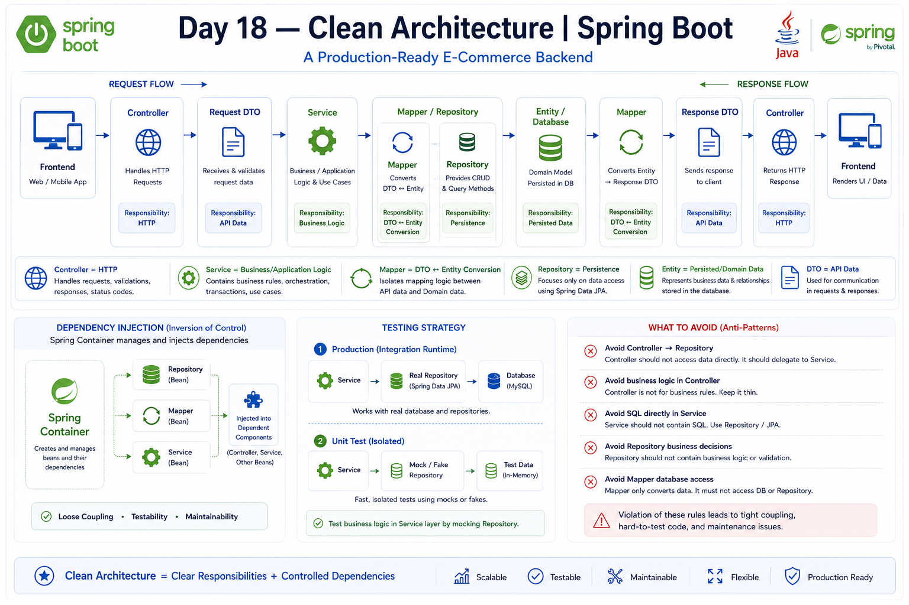

# Day 18 — Clean Architecture

## 📚 Overview

Day 18 focused on Clean Architecture principles and how responsibilities should be separated in a Spring Boot application.

> **Clean Architecture = clear responsibilities + controlled dependencies.**

## 🎯 Learning Objectives

- Understand Clean Architecture
- Understand Separation of Concerns
- Understand Controller, Service, Repository, Mapper, Entity and DTO responsibilities
- Understand dependency direction
- Understand Dependency Injection and Dependency Inversion
- Understand testability through dependency replacement
- Understand Mock and Fake concepts
- Understand package structure vs actual architecture
- Avoid over-engineering
- Understand practical layered architecture
- Apply these principles to Nexora

## 1. Separation of Concerns

Each component should have a focused responsibility.

```text
Controller
    ↓
Service
   ↙   ↘
Mapper Repository
   ↓      ↓
Entity  Database
```

A Controller should not directly perform database operations or business decisions.

## 2. Layer Responsibilities

### Controller

Handles:

- HTTP requests
- HTTP responses
- Request/response handling
- Status codes
- DTOs

### Service

Handles:

- Business logic
- Application/use-case logic
- Business decisions
- Coordination of Mapper and Repository
- Transaction boundaries when required

Example:

```java
if (product.getStock() <= 0) {
    throw new ProductUnavailableException();
}
```

### Repository

Handles:

- Database access
- Queries
- Persistence

Example:

```java
productRepository.findById(id);
```

### Mapper

Handles:

```text
DTO → Entity
Entity → DTO
```

### Entity

Represents persisted/domain data.

### DTO

Represents data transferred through the API.

```text
Request DTO  → Frontend → Backend
Response DTO → Backend → Frontend
```

## 3. Thin Controller

A clean Controller delegates work to the Service:

```java
@GetMapping("/{id}")
public ProductResponseDTO getProduct(@PathVariable Long id) {
    return productService.getProduct(id);
}
```

The Controller should not know:

- Which Repository method is used
- How the Entity is mapped
- How business rules are checked
- How the database works

## 4. Dependency Direction

A practical Spring Boot flow is:

```text
Controller
    ↓
Service
   ↙   ↘
Mapper Repository
   ↓      ↓
Entity  Database
```

The Service coordinates the required components.

The Service should not be tightly coupled to low-level database implementation details.

## 5. Dependency Injection

Spring manages the application's dependencies.

```java
@Service
public class ProductService {

    private final ProductRepository productRepository;
    private final ProductMapper productMapper;

    public ProductService(ProductRepository productRepository,
                          ProductMapper productMapper) {
        this.productRepository = productRepository;
        this.productMapper = productMapper;
    }
}
```

Conceptually:

```text
Spring Container
      ↓
creates Repository
      ↓
creates Mapper
      ↓
creates Service
      ↓
injects dependencies
```

## 6. Dependency Inversion

The Service should work with abstractions rather than being tightly coupled to low-level implementation details.

```java
public interface ProductRepository
        extends JpaRepository<Product, Long> {
}
```

The Service uses:

```java
productRepository.findById(id);
```

It does not need to know the exact database SQL.

> **Program against abstractions, not concrete implementations.**

## 7. Testability

Clean separation allows components to be tested independently.

Production:

```text
ProductService
      ↓
Real ProductRepository
      ↓
Database
```

Unit test:

```text
ProductService
      ↓
Mock/Fake ProductRepository
      ↓
Test data
```

This allows Service logic to be tested without depending on the real database.

Mockito will be studied later.

## 8. Fake vs Mock

A **Fake** is a simple test implementation that behaves like the dependency.

A **Mock** is a test-controlled object, commonly created with Mockito, where expected behavior can be configured.

```text
Production
Service → Real Repository → Database

Test
Service → Mock/Fake Repository → Test Data
```

Dependency Injection makes replacing dependencies possible.

## 9. Package Structure vs Architecture

Having:

```text
controller/
service/
repository/
```

does not automatically mean the application follows Clean Architecture.

Package structure organizes code.

Architecture defines:

- Responsibilities
- Dependency relationships
- Communication between components

For example:

```text
Controller → Repository
```

may be poorly designed even if the packages are perfectly organized.

> **Package structure organizes the code. Architecture organizes responsibilities and dependencies.**

## 10. Avoid Over-Engineering

Clean Architecture does not mean creating unnecessary classes.

Avoid adding layers such as:

```text
ProductManager
ProductProcessor
ProductHandler
ProductCoordinator
```

unless they provide a real benefit.

```text
❌ Maximum number of classes

✅ Clear responsibilities with appropriate separation
```

## 11. Layered Architecture

Our practical Spring Boot approach is primarily layered architecture using clean-architecture principles.

```text
Presentation Layer
        ↓
Controller
        ↓
Application/Service Layer
        ↓
Persistence Layer
        ↓
Repository
        ↓
Database
```

Alongside:

```text
DTO ↔ Mapper ↔ Entity
```

## 12. Business Use Cases

A larger operation such as creating an order may involve:

```text
OrderService
 ├── Check Cart
 ├── Check Stock
 ├── Calculate Total
 ├── Create Order
 └── Save Order
```

The overall business process belongs primarily in the Service.

A Service may coordinate multiple dependencies:

```text
OrderService
 ├── CartRepository
 ├── ProductRepository
 ├── OrderRepository
 └── OrderMapper
```

## 13. What We Should Avoid

### Controller directly accessing Repository

```text
Controller → Repository
```

### Controller containing business logic

```java
if (stock <= 0) {
    // business decision
}
```

### Service writing SQL directly

```sql
SELECT * FROM product WHERE id = ?
```

### Mapper accessing Repository

```text
Mapper → Repository
```

### Repository containing business decisions

```java
if (user.isPremium()) {
    // business decision
}
```

### Returning Entity directly when a DTO is appropriate

```java
return product;
```

Prefer:

```java
return productMapper.toResponseDTO(product);
```

## 14. Nexora Target Architecture

This describes the architecture we are designing for Nexora. It does **not** mean all of these domain components have already been implemented.

```text
                    FRONTEND
                       │
                       ▼
                 ┌───────────┐
                 │ Controller│
                 └─────┬─────┘
                       │
                 Request DTO
                       │
                       ▼
                 ┌───────────┐
                 │  Service  │
                 └─────┬─────┘
                       │
             ┌─────────┴─────────┐
             ▼                   ▼
        ┌─────────┐       ┌────────────┐
        │  Mapper │       │ Repository │
        └────┬────┘       └──────┬─────┘
             │                   │
             ▼                   ▼
          Entity             Database
             │
             └──────────┐
                        ▼
                     Mapper
                        │
                        ▼
                Response DTO
                        │
                        ▼
                   Controller
                        │
                        ▼
                    FRONTEND
```

## 🧠 Key Takeaways

```text
Controller
    = HTTP

DTO
    = API data

Service
    = Business/application logic

Mapper
    = Conversion

Repository
    = Persistence

Entity
    = Persisted/domain data

Database
    = Storage
```

> **Clean Architecture = clear responsibilities + controlled dependencies.**

## 🖼️ Visual Overview


