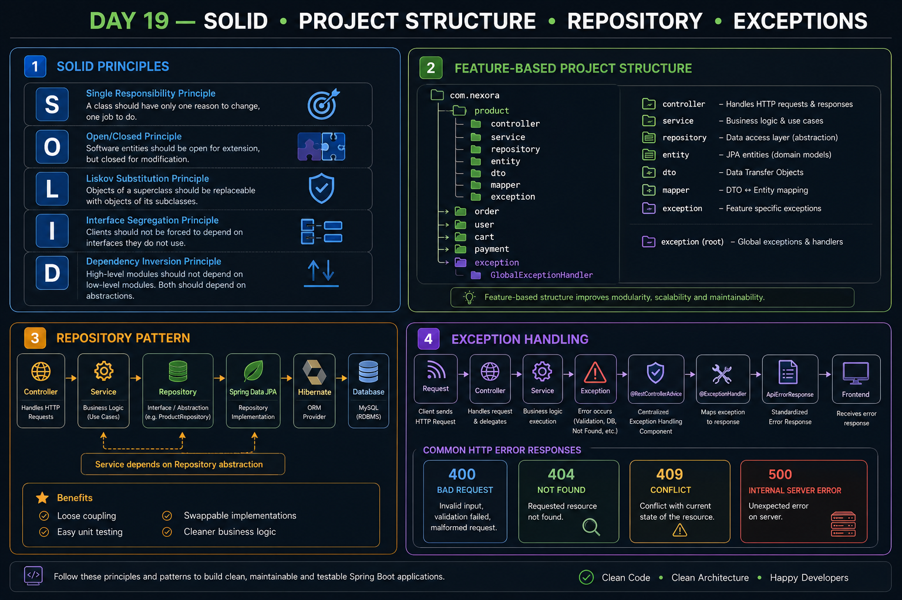

# Day 19 — SOLID, Project Structure, Repository Pattern & Exception Handling

## 📌 Overview

Day 19 focused on improving the architecture and maintainability of the Nexora Spring Boot application.

The main topics covered were:

- SOLID Principles
- Feature-Based Project Structure
- Repository Pattern
- Custom Exceptions
- Global Exception Handling
- `@ExceptionHandler`
- `@RestControllerAdvice`
- Structured API Error Responses
- HTTP Error Status Codes

---

## 1. SOLID Principles

### S — Single Responsibility Principle

A class should have one focused responsibility.

### O — Open/Closed Principle

Software entities should be open for extension but closed for modification.

### L — Liskov Substitution Principle

Subtypes should be replaceable for their parent types without breaking expected behavior.

### I — Interface Segregation Principle

Clients should not be forced to depend on methods they do not use.

Prefer smaller, focused interfaces instead of one large interface.

### D — Dependency Inversion Principle

High-level components should depend on abstractions rather than concrete implementations.

Example:

```java
class OrderService {

    private final OrderRepository repository;

    public OrderService(OrderRepository repository) {
        this.repository = repository;
    }
}
````

The Service depends on the `OrderRepository` abstraction instead of directly creating a concrete database implementation.

---

## 2. Feature-Based Project Structure

For a large application such as Nexora, organizing everything only by technical layer can become difficult to navigate.

Instead, we use a feature-oriented structure.

Example:

```text
com.nexora
│
├── NexoraApplication.java
│
├── product
│   ├── controller
│   ├── service
│   ├── repository
│   ├── entity
│   ├── dto
│   │   ├── request
│   │   └── response
│   ├── mapper
│   └── exception
│
├── category
│   ├── controller
│   ├── service
│   ├── repository
│   ├── entity
│   ├── dto
│   ├── mapper
│   └── exception
│
├── user
├── shop
├── cart
├── order
├── payment
└── review
│
├── exception
│   ├── GlobalExceptionHandler
│   └── ApiErrorResponse
│
├── config
└── security
```

### Feature Boundaries

Each feature owns its own business responsibilities.

```text
product/  → Product-related responsibilities
order/    → Order-related responsibilities
payment/  → Payment-related responsibilities
user/     → User-related responsibilities
```

Features can collaborate, but they should maintain clear responsibilities and boundaries.

---

## 3. Repository Pattern

The Repository provides an abstraction for data access and persistence.

Typical Nexora flow:

```text
Controller
    ↓
Service
    ↓
Repository
    ↓
Spring Data JPA
    ↓
Hibernate
    ↓
Database
```

Example:

```java
public interface ProductRepository
        extends JpaRepository<Product, Long> {

    List<Product> findByCategoryId(Long categoryId);
}
```

The Repository handles data-access operations such as:

```java
findById()
findAll()
save()
delete()
findByCategoryId()
```

The Service handles application/business logic.

### Service vs Repository

```text
Repository
→ How do I access the data?

Service
→ What should the application do with that data?
```

For example:

```java
public ProductResponseDTO getProduct(Long id) {

    Product product = productRepository.findById(id)
            .orElseThrow(() ->
                    new ProductNotFoundException(
                            "Product not found with id: " + id
                    ));

    return productMapper.toResponseDTO(product);
}
```

---

## 4. Custom Exceptions

Instead of using generic exceptions everywhere, meaningful custom exceptions can represent application-specific problems.

Example:

```java
public class ProductNotFoundException
        extends RuntimeException {

    public ProductNotFoundException(String message) {
        super(message);
    }
}
```

Usage:

```java
Product product = productRepository.findById(id)
        .orElseThrow(() ->
                new ProductNotFoundException(
                        "Product not found with id: " + id
                ));
```

Examples of Nexora exceptions:

```text
ProductNotFoundException
OrderNotFoundException
UserNotFoundException
InsufficientStockException
PaymentFailedException
```

---

## 5. `@ExceptionHandler`

`@ExceptionHandler` tells Spring which method should handle a particular exception.

Example:

```java
@ExceptionHandler(ProductNotFoundException.class)
public ResponseEntity<String> handleProductNotFound(
        ProductNotFoundException ex) {

    return ResponseEntity
            .status(HttpStatus.NOT_FOUND)
            .body(ex.getMessage());
}
```

It connects a specific exception type with a response-handling method.

---

## 6. `@RestControllerAdvice`

`@RestControllerAdvice` provides centralized exception handling across REST Controllers.

Example:

```java
@RestControllerAdvice
public class GlobalExceptionHandler {

    @ExceptionHandler(ProductNotFoundException.class)
    public ResponseEntity<String> handleProductNotFound(
            ProductNotFoundException ex) {

        return ResponseEntity
                .status(HttpStatus.NOT_FOUND)
                .body(ex.getMessage());
    }
}
```

Instead of putting exception-handling logic inside every Controller, we can maintain it in one centralized location.

---

## 7. `ApiErrorResponse`

Returning only a String is not ideal for a production API.

Instead, we can use a structured error DTO.

Example response:

```json
{
    "status": 404,
    "message": "Product not found with id: 999",
    "timestamp": "2026-08-15T13:30:00"
}
```

Example DTO:

```java
public class ApiErrorResponse {

    private int status;
    private String message;
    private LocalDateTime timestamp;

    // constructor, getters
}
```

This provides the frontend with a consistent error structure.

---

## 8. Complete Exception Flow

### Product Not Found

```text
Frontend
    ↓
Controller
    ↓
Service
    ↓
Repository
    ↓
Product not found
    ↓
ProductNotFoundException
    ↓
Spring Exception Handling
    ↓
@RestControllerAdvice
    ↓
@ExceptionHandler
    ↓
ApiErrorResponse
    ↓
HTTP Response
    ↓
Frontend
```

### Important

`orElseThrow()` throws the exception.

It does **not** directly send the response to the frontend.

Spring's exception-handling mechanism finds the appropriate handler, which creates the HTTP response.

---

## 9. Request DTO Validation vs Service Exceptions

These are two different flows.

### Invalid Request DTO

```text
Frontend
    ↓
Controller
    ↓
@Valid RequestDTO
    ↓
Validation fails
    ↓
MethodArgumentNotValidException
    ↓
GlobalExceptionHandler
    ↓
400 BAD REQUEST
```

The Service is **not called** when validation fails before the Controller method executes.

### Product Not Found

```text
Frontend
    ↓
Controller
    ↓
Service
    ↓
Repository
    ↓
ProductNotFoundException
    ↓
GlobalExceptionHandler
    ↓
404 NOT FOUND
```

Here the Service was already called.

---

## 10. HTTP Error Status Codes

| Situation                                     |                 HTTP Status |
| --------------------------------------------- | --------------------------: |
| Invalid request/validation failure            |           `400 BAD REQUEST` |
| Resource doesn't exist                        |             `404 NOT FOUND` |
| Request conflicts with current resource state |              `409 CONFLICT` |
| Unexpected server error                       | `500 INTERNAL SERVER ERROR` |

Example:

```text
Invalid product data
→ 400 BAD REQUEST

Product doesn't exist
→ 404 NOT FOUND

Insufficient stock
→ 409 CONFLICT

Unexpected exception
→ 500 INTERNAL SERVER ERROR
```

---

## 11. Safe Error Handling

Known application exceptions can provide meaningful messages:

```text
Product not found with id: 999
```

But unexpected exceptions should generally not expose their raw messages to the client because they may reveal internal implementation details.

Instead:

```json
{
    "status": 500,
    "message": "An unexpected error occurred",
    "timestamp": "..."
}
```

The actual exception can be logged internally for debugging.

---

## 🔄 Day 19 Architecture Summary

```text
                    NEXORA
                       │
        ┌──────────────┼──────────────┐
        ↓              ↓              ↓
      SOLID       Project Structure   Repository
        │              │              │
        ↓              ↓              ↓
   Clean Design   Feature-Based    Data Access
                       │
                       ↓
                  Exceptions
                       │
                       ↓
             GlobalExceptionHandler
                       │
                       ↓
                ApiErrorResponse
                       │
                       ↓
                    Frontend
```

---

## 🎯 Key Takeaways

* SOLID principles help create maintainable and flexible code.
* Nexora uses a feature-based organization to keep related functionality together.
* Each feature should maintain clear responsibilities.
* Repository handles persistence/data access.
* Service handles application and business logic.
* Custom exceptions provide meaningful application-specific errors.
* `@ExceptionHandler` handles specific exception types.
* `@RestControllerAdvice` provides centralized REST exception handling.
* `ApiErrorResponse` gives the frontend a consistent error format.
* Request DTO validation happens before normal Service processing when validation fails.
* `orElseThrow()` throws an exception; the exception handler is responsible for converting it into an HTTP response.
* Appropriate HTTP status codes should be returned for different error situations.

---

## 🖼️ Visual Overview

