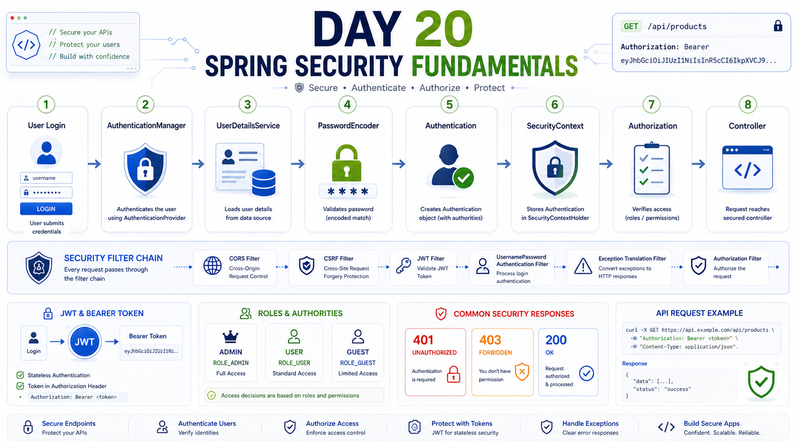

# Day 20 — Spring Security Fundamentals 🔐

> Understanding authentication, authorization, security filters, user security information, JWT fundamentals, CORS, CSRF, and stateless authentication.

---

## 🎯 Learning Objective

The goal of Day 20 was to understand the **fundamental architecture of Spring Security** before implementing security in the Nexora project.

Instead of memorizing security configuration code, the focus was on understanding the responsibility of each component and how they work together.

---

# 📚 Topics Covered

## 1. Authentication

Authentication answers:

> **Who are you?**

Example:

```text
User → Login → Credentials verified → User authenticated
````

---

## 2. Authorization

Authorization answers:

> **What are you allowed to do?**

Example:

```text
CUSTOMER → /api/products      ✅
CUSTOMER → /api/admin/**      ❌
ADMIN    → /api/admin/**      ✅
```

---

## 3. Authentication vs Authorization

| Concept        | Meaning                             |
| -------------- | ----------------------------------- |
| Authentication | Identifies the user                 |
| Authorization  | Determines what the user can access |

---

# 🔐 Security Filter Chain

Spring Security processes HTTP requests through a security filter chain before the request reaches the Controller.

```text
HTTP Request
     ↓
Security Filter Chain
     ↓
Authentication
     ↓
Authorization
     ↓
Controller
     ↓
Service
     ↓
Repository
```

The `SecurityFilterChain` is used to configure how HTTP requests are secured.

---

# 🛡️ Request Authorization Rules

Learned the purpose of:

```java
.requestMatchers("/api/auth/**")
    .permitAll()
```

Allows matching requests without authentication.

```java
.requestMatchers("/api/admin/**")
    .hasRole("ADMIN")
```

Requires the user to have the ADMIN role.

```java
.anyRequest()
    .authenticated()
```

Requires authentication for requests that were not matched by previous rules.

### Example

```java
.authorizeHttpRequests(auth -> auth

    .requestMatchers("/api/auth/**")
        .permitAll()

    .requestMatchers("/api/admin/**")
        .hasRole("ADMIN")

    .anyRequest()
        .authenticated()
);
```

---

# 👤 UserDetails

`UserDetails` is a Spring Security interface representing the security-related information of a user.

It can contain information such as:

```text
Username
Password
Authorities / Roles
Account status
Account locked status
Credentials status
```

It acts as a bridge between our application's user information and Spring Security.

---

# 🔎 UserDetailsService

`UserDetailsService` is a Spring Security interface used to load a user's security information.

Important method:

```java
UserDetails loadUserByUsername(String username);
```

Typical flow:

```text
Spring Security
      ↓
UserDetailsService
      ↓
UserRepository
      ↓
User Entity
      ↓
UserDetails
```

Example:

```java
@Override
public UserDetails loadUserByUsername(String email)
        throws UsernameNotFoundException {

    User user = userRepository.findByEmail(email)
            .orElseThrow(() ->
                new UsernameNotFoundException("User not found")
            );

    return org.springframework.security.core.userdetails.User
            .withUsername(user.getEmail())
            .password(user.getPassword())
            .roles(user.getRole())
            .build();
}
```

The returned object is Spring Security's implementation of `UserDetails`.

---

# 🔑 PasswordEncoder

`PasswordEncoder` is responsible for securely hashing passwords and verifying passwords.

Example:

```java
@Bean
public PasswordEncoder passwordEncoder() {
    return new BCryptPasswordEncoder();
}
```

Conceptually:

```text
Raw Password
     ↓
BCryptPasswordEncoder
     ↓
Password Hash
```

During authentication:

```text
Entered Password
       +
Stored Hash
       ↓
PasswordEncoder
       ↓
Match?
```

Passwords should never be stored as plain text.

---

# ⚙️ AuthenticationManager

`AuthenticationManager` is a Spring Security interface responsible for coordinating authentication.

Conceptually:

```text
Username + Password
        ↓
AuthenticationManager
        ↓
UserDetailsService
        ↓
PasswordEncoder
        ↓
Authentication Result
```

Authentication succeeds when the supplied credentials are valid.

---

# 🔐 JWT Fundamentals

JWT stands for:

**JSON Web Token**

A JWT has three main parts:

```text
Header.Payload.Signature
```

### Header

Contains information such as the signing algorithm.

### Payload

Contains claims.

Example:

```json
{
    "sub": "15",
    "role": "CUSTOMER",
    "exp": 1735689600
}
```

### Signature

Protects the token against unauthorized modification.

If someone changes:

```text
CUSTOMER
```

to:

```text
ADMIN
```

without being able to produce a valid signature, token verification fails.

---

# 🎫 Bearer Token

JWT access tokens are commonly sent using the Authorization header:

```http
Authorization: Bearer <JWT>
```

Breakdown:

```text
Authorization
      ↓
HTTP Header

Bearer
      ↓
Authentication Scheme

JWT
      ↓
Access Token
```

---

# 🔄 JWT Authentication Flow

```text
User Login
    ↓
AuthenticationManager
    ↓
UserDetailsService
    ↓
UserRepository
    ↓
PasswordEncoder
    ↓
Authentication Successful
    ↓
JWT Created
    ↓
Frontend
```

For future requests:

```text
Frontend
    ↓
Authorization: Bearer <JWT>
    ↓
JWT Authentication Filter
    ↓
Validate JWT
    ↓
Create Authentication
    ↓
SecurityContext
    ↓
Authorization
    ↓
Controller
```

---

# 🧩 JWT Authentication Filter

A JWT filter is responsible for processing incoming JWT-based authentication.

Conceptual responsibilities:

```text
1. Read Authorization header
2. Check Bearer token
3. Extract JWT
4. Validate JWT
5. Extract user information
6. Create Authentication
7. Store Authentication in SecurityContext
8. Continue the filter chain
```

---

# 🧠 SecurityContext

The `SecurityContext` contains the current authentication information.

Conceptually:

```text
SecurityContext
       ↓
Authentication
       ↓
Current User
       ↓
Authorities / Roles
```

Spring Security can access this information during request processing.

---

# 🔗 SecurityContextHolder

`SecurityContextHolder` provides access to the current security context.

Example:

```java
Authentication authentication =
        SecurityContextHolder
                .getContext()
                .getAuthentication();
```

It can be used to obtain the current authentication information.

---

# 🌐 CORS

CORS stands for:

**Cross-Origin Resource Sharing**

It controls which origins are allowed to make browser-based cross-origin requests.

Example:

```text
Frontend
http://localhost:3000
       ↓
       CORS
       ↓
Backend
http://localhost:8080
```

CORS is **not authentication** and is **not authorization**.

```text
CORS
→ Which origins can make browser requests?

Authentication
→ Who is the user?

Authorization
→ What can the user access?
```

---

# 🛡️ CSRF

CSRF stands for:

**Cross-Site Request Forgery**

It is especially relevant to authentication mechanisms where browsers automatically send credentials such as cookies.

Typical session/cookie scenario:

```text
Browser
   ↓
Automatically sends cookie
   ↓
Authenticated request
```

For a typical stateless API using:

```http
Authorization: Bearer <JWT>
```

the CSRF threat model is different.

> CSRF should not simply be disabled blindly; the correct configuration depends on how authentication credentials are transported.

---

# 🔄 Session vs Stateless Authentication

### Session-based

```text
Login
  ↓
Server creates session
  ↓
Session ID stored by browser
  ↓
Future request sends session cookie
  ↓
Server uses session information
```

### JWT-based Stateless Authentication

```text
Login
  ↓
JWT generated
  ↓
Frontend receives JWT
  ↓
Future request sends JWT
  ↓
Server validates JWT
```

Stateless authentication does **not** mean the application has no database or no state.

It means authentication does not depend on a traditional server-side session for every request.

---

# 🚦 HTTP Security Responses

## 401 Unauthorized

Generally indicates that authentication is missing or not accepted.

```text
Request
   ↓
No valid authentication
   ↓
401
```

## 403 Forbidden

The user is authenticated but does not have sufficient permission.

```text
User = CUSTOMER
Required = ADMIN
       ↓
403 Forbidden
```

### Easy way to remember

```text
401 → Who are you?
403 → I know who you are, but you're not allowed.
```

---

# 🏗️ Complete Spring Security Mental Model

```text
                         LOGIN
                           ↓
                 AuthenticationManager
                           ↓
                  UserDetailsService
                           ↓
                     UserRepository
                           ↓
                         User
                           ↓
                     UserDetails
                           ↓
                   PasswordEncoder
                           ↓
                    Authentication
                           ↓
                          JWT
                           ↓
                       Frontend
                           ↓
              Authorization: Bearer JWT
                           ↓
                    JWT Authentication
                         Filter
                           ↓
                    Validate JWT
                           ↓
                    SecurityContext
                           ↓
                     Authorization
                       /       \
                      /         \
                   ALLOW       DENY
                     ↓           ↓
                Controller      403
                     ↓
                  Service
                     ↓
                Repository
```

---

# 🧪 Important Concepts Learned

* Authentication
* Authorization
* SecurityFilterChain
* HttpSecurity
* UserDetails
* UserDetailsService
* AuthenticationManager
* Authentication
* PasswordEncoder
* BCrypt
* SecurityContext
* SecurityContextHolder
* JWT fundamentals
* JWT Header
* JWT Payload
* JWT Signature
* JWT Claims
* Bearer Token
* JWT Authentication Filter
* CORS
* CSRF
* Stateless Authentication
* Session-based Authentication
* `401 Unauthorized`
* `403 Forbidden`
* `permitAll()`
* `authenticated()`
* `hasRole()`
* `hasAuthority()`
* `requestMatchers()`

---

# 💡 Key Takeaways

### 1. Authentication

```text
Who are you?
```

### 2. Authorization

```text
What are you allowed to do?
```

### 3. UserDetailsService

```text
Loads the user's security information.
```

### 4. PasswordEncoder

```text
Hashes and verifies passwords.
```

### 5. AuthenticationManager

```text
Coordinates authentication.
```

### 6. SecurityFilterChain

```text
Defines how HTTP requests are secured.
```

### 7. JWT

```text
A signed token commonly used for stateless authentication.
```

### 8. JWT Filter

```text
Reads and validates JWTs from incoming requests
and establishes authentication.
```

### 9. CORS

```text
Controls allowed browser origins.
```

### 10. CSRF

```text
Protects against forged authenticated requests,
especially relevant to cookie-based authentication.
```

---
## 🖼️ Visual Overview

